# Architecture Documentation

## Overview

This project implements a fully automated DevOps pipeline using **GitHub Actions as the control plane** to provision and configure AWS infrastructure, deploy monitoring services, and manage webservers.

---

## Architecture Diagram

```mermaid
graph TB
    subgraph GitHub["☁️ GitHub Cloud"]
        Dev[👤 Developer] -->|Git Push| Repo[📦 Repository]
        Repo -->|Triggers| GHA[⚙️ GitHub Actions Runner]
    end
    
    subgraph AWS["☁️ AWS Cloud - VPC"]
        MN[🔍 Monitoring Node<br/>Prometheus + Grafana + Alertmanager]
        WS1[🌐 Webserver-1<br/>Apache + Exporters]
        WS2[🌐 Webserver-2<br/>Apache + Exporters]
    end
    
    GHA -->|1. Terraform Apply| AWS
    GHA -->|2. Ansible Playbooks via SSH| MN
    GHA -->|2. Ansible Playbooks via SSH| WS1
    GHA -->|2. Ansible Playbooks via SSH| WS2
    
    MN -->|Scrapes Metrics| WS1
    MN -->|Scrapes Metrics| WS2
    
    Dev -.->|Access Dashboards| MN
    Dev -.->|Access Websites| WS1
    Dev -.->|Access Websites| WS2
    
    style GHA fill:#4CAF50
    style MN fill:#2196F3
    style WS1 fill:#FF9800
    style WS2 fill:#FF9800
```



---

## Key Components

### 1. **GitHub Actions Runner** (Control Plane)
**Role**: Orchestration and automation hub

**Responsibilities**:
- Execute Terraform to provision AWS infrastructure
- Run Ansible playbooks to configure all EC2 instances
- Deploy monitoring stack (Prometheus, Grafana, Alertmanager)
- Run comprehensive validation tests
- Report deployment status

**Benefits**:
- No dependency on EC2 bootstrap scripts
- Reliable, reproducible deployments
- Built-in retry mechanisms and error handling
- Complete audit trail

---

### 2. **Monitoring Node** (EC2)  
**Role**: Centralized observability platform

**Services Running**:
- **Prometheus**: Metrics collection and storage
- **Grafana**: Visualization dashboards
- **Alertmanager**: Alert routing and notification

**Deployment Method**:
- Minimal cloud-init bootstrap (basic utilities only)
- Ansible installs Docker and Docker Compose
- Monitoring stack deployed via Docker Compose
- Auto-configured Prometheus targets via EC2 service discovery
- Auto-provisioned Grafana dashboards

**Endpoints**:
- Prometheus: `http://<monitoring-ip>:9090`
- Grafana: `http://<monitoring-ip>:3000`
- Alertmanager: `http://<monitoring-ip>:9093`

---

### 3. **Webserver Nodes** (2x EC2)
**Role**: Application hosting with observability

**Services Running**:
- **Apache2**: Web server
- **Node Exporter**: Host metrics (port 9100)
- **cAdvisor**: Container metrics (port 8080)

**Deployment Method**:
- Minimal cloud-init bootstrap
- Ansible installs Apache2 and Docker
- Website templates rendered with Jinja2
- Exporters deployed via Docker

**Endpoints**:
- Website: `http://<webserver-ip>/`
- Node Exporter: `http://<webserver-ip>:9100/metrics`
- cAdvisor: `http://<webserver-ip>:8080/metrics`

---

## Deployment Flow

### Phase 0: Pre-flight Checks
```
✓ Verify AWS credentials
✓ Load SSH keys
✓ Validate repository structure
```

### Phase 1: Infrastructure Provisioning
```
Terraform:
├── VPC + Subnets
├── Security Groups
├── EC2 Instances (1 monitoring + 2 webservers)
└── SSH Key Pairs
```

### Phase 2: Inventory & Connectivity
```
Ansible Dynamic Inventory:
├── Discover all running EC2 instances
├── Group by Name tag
└── Verify SSH connectivity
```

### Phase 3: Monitoring Node Setup
```
Ansible Playbook:
├── Install Docker + Docker Compose
├── Create directory structure
├── Deploy Prometheus, Grafana, Alertmanager
└── Configure provisioning (datasources, dashboards)
```

### Phase 4: Webserver Setup
```
Ansible Playbooks:
├── Install Apache2
├── Render website templates
├── Install Docker
├── Deploy node-exporter and cAdvisor
└── Verify services running
```

### Phase 5: Monitoring Integration
```
Prometheus:
├── EC2 service discovery
├── Discover webserver exporters
└── Start scraping metrics

Grafana:
└── Auto-load dashboards
```

### Phase 6: Validation
```
Comprehensive tests:
✓ All EC2 instances running
✓ Monitoring services healthy
✓ Webservers accessible
✓ All Prometheus targets UP
✓ Grafana dashboards loaded
```

---

## Network Architecture

### VPC Configuration
- **CIDR**: `10.0.0.0/16`
- **Public Subnet**: `10.0.1.0/24` (us-east-1a)

### Security Groups

#### Monitoring Node Security Group
| Type | Port | Source | Purpose |
|------|------|--------|---------|
| SSH | 22 | 0.0.0.0/0 | GitHub Actions access |
| HTTP | 80 | 0.0.0.0/0 | Web access |
| Prometheus | 9090 | 0.0.0.0/0 | Metrics UI |
| Grafana | 3000 | 0.0.0.0/0 | Dashboards |
| Alertmanager | 9093 | 0.0.0.0/0 | Alerts UI |

#### Webserver Security Group
| Type | Port | Source | Purpose |
|------|------|--------|---------|
| SSH | 22 | Monitoring SG | Ansible access |
| HTTP | 80 | 0.0.0.0/0 | Public web access |
| Node Exporter | 9100 | 0.0.0.0/0 | Prometheus scraping |
| cAdvisor | 8080 | 0.0.0.0/0 | Prometheus scraping |

---

## Technology Stack

| Layer | Technology |
|-------|-----------|
| CI/CD | GitHub Actions |
| Infrastructure as Code | Terraform |
| Configuration Management | Ansible |
| Containerization | Docker, Docker Compose |
| Monitoring | Prometheus |
| Visualization | Grafana |
| Alerting | Alertmanager |
| Web Server | Apache2 |
| Metrics Exporters | Node Exporter, cAdvisor |

---

## Differences from Previous Architecture

### Old Architecture ❌
```
Local PC → Terraform → EC2 "Control Node"
  └── User-data script installs Ansible, Docker (often fails)
  └── Git clone repository
  └── Manually run Ansible playbooks
  └── Manually configure Prometheus targets
  └── Manually import Grafana dashboards
```

**Problems**:
- Unreliable bootstrap (download failures, corruption)
- Manual post-deployment work
- No version control for execution
- "Lucky if it works" success rate

### New Architecture ✅
```
Developer → GitHub → Actions Runner
  ├── Terraform (infrastructure only)
  └── Ansible (all configuration)
      ├── Monitoring Node setup
      └── Webserver setup
  
All EC2 nodes:
  └── Minimal bootstrap (no heavy installs)
  └── Ansible handles everything
```

**Benefits**:
- ~95%+ success rate
- Zero manual intervention
- Complete automation
- Comprehensive testing
- Audit trail in GitHub Actions logs

---

## Scaling Considerations

### Add More Webservers
Update Terraform `main.tf`:
```hcl
module "webserver" {
  source = "./modules/Workernode"
  count  = 5  # Increase from 2
  ...
}
```

Ansible and Prometheus will automatically discover and configure them!

### Add More Monitoring Metrics
1. Add exporter to webservers (via Ansible)
2. Update Prometheus scrape config
3. Create/import Grafana dashboard

---

## Disaster Recovery

### Full Infrastructure Rebuild
```bash
# Run destroy workflow (manual confirmation required)
# Then re-run deploy workflow
```

**Result**: Identical infrastructure in 8-12 minutes

### Rollback
```bash
git revert <commit>
git push origin main
```

GitHub Actions will deploy the previous version.

---

## Monitoring & Observability

### What We Monitor
- **Host Metrics**: CPU, Memory, Disk, Network (Node Exporter)
- **Container Metrics**: Docker container stats (cAdvisor)
- **Service Health**: Prometheus targets, Grafana datasources
- **Custom Metrics**: Apache access logs, request rates

### Alert Rules
Configured in `Monitoring/prometheus/rules.yml`:
- Instance down for > 5 minutes
- High CPU usage (> 80%)
- High memory usage (> 90%)
- Disk space low (< 10%)

---

## Cost Estimation

| Resource | Type | Quantity | Est. Monthly Cost |
|----------|------|----------|-------------------|
| EC2 Instances | t2.micro | 3 | ~$30 |
| Data Transfer | Egress | ~10 GB | ~$1 |
| EBS Volumes | GP2 | 3 x 8 GB | ~$2.40 |
| **Total** | | | **~$33.40/mo** |

> **Note**: GitHub Actions minutes are free for public repos, limited for private repos.

---

## Future Enhancements

1. **Remote State Backend**: S3 + DynamoDB for Terraform state
2. **Auto-scaling**: ASG for webservers
3. **HTTPS**: SSL certificates with Let's Encrypt
4. **Backup**: Automated Grafana dashboard backups
5. **Cost Monitoring**: Infracost integration
6. **Security Scanning**: tfsec, checkov
7. **Notifications**: Slack/Discord alerts
8. **Multi-region**: Deploy to multiple AWS regions
